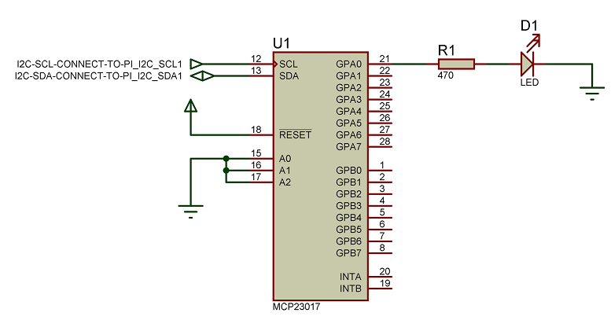
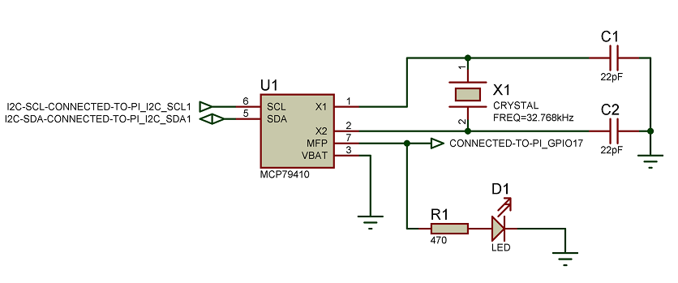

# Overview

These examples demonstrate simple uses of Erlang/ALE. To compile then, just
run:

    make

The examples can be run via Makefile targets.

# gpio_counter

For this example, connect a button to GPIO 17 and another button to GPIO 22.
Connect GPIO 23 and GPIO 24 to LEDs. Pressing the button on GPIO 22 will increase
the "count" on the LEDs and the GPIO 17 button will decrease it.

# ale_handler_gpio_int_test

For this example connect GPIO 27 to GPIO 22. GPIO 27 will be the interrupt pin,
and GPIO 22 will provides the signals to generate interrupts.
To generate interrupts just use ale_handler_gpio_int_test:press_btn/0 and ale_handler_gpio_int_test:release_btn/0
functions.
The default interrupt condition is rising, but it is possible change it by
ale_handler_gpio_int_test:set_int_condition/1 function, where the input parameter can be:
falling | rising | both | none | enabled | summarize

Step-by-step:

	cd example
	make all
	make shell

Start test application when rising interrupt edge will generates interrupt by ale_handler_gpio_int_test:start_link/0
	
	5> ale_handler_gpio_int_test:start_link().
	=INFO REPORT==== 22-Apr-2015::05:55:19 ===
	    "ALE driver process has been started and registered successfully."
	    drvModule: gpio
	    drvStartFunction: start
	    drvStartArgs: [27,input]
	    drvPid: <0.46.0>
	    monitorRef: #Ref<0.0.0.62>
	{ok,<0.44.0>}
	
Simulate button press event by 
	ale_handler_gpio_int_test:press_btn/0
	
	8> ale_handler_gpio_int_test:press_btn().
	=INFO REPORT==== 22-Apr-2015::05:55:51 ===
	    "ALE driver process has been started and registered successfully."
	    drvModule: gpio
	    drvStartFunction: start
	    drvStartArgs: [22,output]
	    drvPid: <0.50.0>
	    monitorRef: #Ref<0.0.0.83>
	ok
	9>
Rising interrupt event has been received by test application from driver:

	=INFO REPORT==== 22-Apr-2015::05:55:51 ===
	    "Interrupt has been occurred."
	    gpio: 27
	    interrupt_condition: rising

Release the button by ale_handler_gpio_int_test:release_btn/0. No interrupt event should be received by test application at this time.
	
	9> ale_handler_gpio_int_test:release_btn().
	ok
	10>
	
Press the button again and see, rising interrupt has been received again:

	10> ale_handler_gpio_int_test:press_btn().
	
	=INFO REPORT==== 22-Apr-2015::05:56:24 ===
	    "Interrupt has been occurred."
	    gpio: 27
	    interrupt_condition: rising
	ok

Change the interrupt condition to falling edge.

	11> ale_handler_gpio_int_test:set_int_condition(falling).
	ok

Release the pressed button. Falling interrupt event should be received by the test application:

	12> ale_handler_gpio_int_test:press_btn().
	ok
	12> ale_handler_gpio_int_test:release_btn().
	
	=INFO REPORT==== 22-Apr-2015::05:56:42 ===
	    "Interrupt has been occurred."
	    gpio: 27
	    interrupt_condition: falling
	ok
	13>

# ex_mcp23x17:start_i2c_blinking_led/4

This example shows how to blinking a LED connected to the a PIN of I2C IO expander device.

Here is the schematic about circuit:

	Before try out this example, the following preparation needs to be done on the IO expander device:
	-  Connect MCP23017 IO expander Pins:
		PIN9  - VDD
		PIN10 - VSS
		PIN12 - I2C-SCL -> Raspberry Pi PIN5
		PIN13 - I2C-SDA -> Raspberry Pi PIN3
		PIN15 - VSS
		PIN16 - VSS
		PIN17 - VSS
		PIN18 - VDD
		PIN21 - LED with 470ohm serial resistor -> VSS
		
		HwAddr	: 16#20, because all Ax PINs are connected to VSS (Ground)
		Port	: IO expander device has 2 Ports, 'A' and 'B'. In this example we are using Port 'A'.
		Pin		: There are 8 PINS on each port side. In this example we are using PIN0.
		Timer	: The periodic time of blinking in msec.
		
		Start blinking LED:
		-------------------
		3> ex_mcp23x17:start_i2c_blinking_led(16#20, 'A', 0, 200).
		
		=INFO REPORT==== 10-Apr-2015::12:21:46 ===
		    "ALE driver process has been started and registered successfully."
		    drvModule: i2c
		    drvStartFunction: start
		    drvStartArgs: ["i2c-1",32]
		    drvPid: <0.44.0>
		    monitorRef: #Ref<0.0.0.1550>
		ok
		
		Stop blinking LED:
		------------------
		4> ex_mcp23x17:stop_i2c_blinking_led().
		
		=INFO REPORT==== 10-Apr-2015::12:21:57 ===
		    "ALE driver has been released."
		    drvPid: <0.44.0>
		    record_in_ets: {rALEHandler,{i2c,"i2c-1",32},
		                                {ale_handler,i2c_write,["i2c-1",32,<<0>>]},
		                                <0.44.0>,#Ref<0.0.0.1550>}
		ok
		5>

# ex_mcp23x17:start_spi_blinking_led/4

This example shows how to blinking a LED connected to the a PIN of SPI IO expander device, when CS PIN of the IO expander is connect to NOT Raspberry Pi's SPI_CS PIN, but connected to a PIN of an I2C IO expander device.

Here is the schematic about the circuit:

	Before try out this example, the following preparation needs to be done on the IO expander devices:
	
	-  Connect MCP23017 (I2C) IO expander Pins:
		PIN9  - VDD
		PIN10 - VSS
		PIN12 - I2C-SCL -> Raspberry Pi PIN5
		PIN13 - I2C-SDA -> Raspberry Pi PIN3
		PIN15 - VSS
		PIN16 - VSS
		PIN17 - VSS
		PIN18 - VDD
		PIN22 - PIN11 on SPI IO expander
		
	- Connect MCP23S17 (SPI) IO expander Pins:
		PIN9  - VDD
		PIN10 - VSS
		PIN11 - SPI_CS  -> PIN22 on I2C IO expander
		PIN12 - SPI-SCL -> Raspberry Pi PIN23
		PIN13 - SPI-SI  -> Raspberry Pi PIN19 (SPI_MOSI)
		PIN14 - SPI-SO  -> Raspberry Pi PIN21 (SPI_MISO)
		PIN15 - VSS
		PIN16 - VSS
		PIN17 - VSS
		PIN18 - VDD
		PIN21 - LED with 470ohm serial resistor -> VSS
		
		Start blinking LED:
		-------------------
		1> ex_mcp23x17:start_spi_blinking_led(32, 'A', 0, 200).
		
		=INFO REPORT==== 10-Apr-2015::12:20:06 ===
		    "ALE driver process has been started and registered successfully."
		    drvModule: i2c
		    drvStartFunction: start
		    drvStartArgs: ["i2c-1",32]
		    drvPid: <0.38.0>
		    monitorRef: #Ref<0.0.0.35>
		
		=INFO REPORT==== 10-Apr-2015::12:20:06 ===
		    "ALE driver process has been started and registered successfully."
		    drvModule: spi
		    drvStartFunction: start
		    drvStartArgs: ["spidev0.0",[]]
		    drvPid: <0.39.0>
		    monitorRef: #Ref<0.0.0.51>
		ok
		
		Stop blinking LED:
		-------------------
		2> ex_mcp23x17:stop_spi_blinking_led().
		
		=INFO REPORT==== 10-Apr-2015::12:20:15 ===
		    "ALE driver has been released."
		    drvPid: <0.39.0>
		    record_in_ets: {rALEHandler,
		                       {spi,"spidev0.0",[]},
		                       {ale_handler,spi_transfer,["spidev0.0",[],<<65,0,0>>]},
		                       <0.39.0>,#Ref<0.0.0.51>}
		
		=INFO REPORT==== 10-Apr-2015::12:20:15 ===
		    "ALE driver has been released."
		    drvPid: <0.38.0>
		    record_in_ets: {rALEHandler,{i2c,"i2c-1",32},
		                                {ale_handler,i2c_write,["i2c-1",32,<<0>>]},
		                                <0.38.0>,#Ref<0.0.0.35>}
		ok
		3>

# ex_mcp7940n - Configure Date&Time and Alarm in RTC device
This example introduces how to configure Date&Time in MCP7940n RTC device and it also shows how easy to configure alarm module for a specific Date&Time.
For this example GPIO-17 on Raspberry has been used as an input PIN. This PIN will receives the interrupts from RTC device. The below schematic can say much more about it.

The current Date&Time (LOCALTIME) will be configured into the RTC device when start the test application and ALARM-0 module will be configured to LOCALTIME+1[min]. The interrupt PIN which is the GPIO-17 on Raspberry Pi will be configured as input for able to receive interrupts from RTC device. Below printouts show the whole sequence. Unfortunately an unexpected interrupt receives on the GPIO-17 once the interrupt condition has been configured, but this interrupt is just a "dummy". Each application who wants use GPIO interrupts must handle this independently. An example can be seen in ale_handler_gpio_int_test.erl module (see above), for how to "ignore" this very first interrupt. Current example does not has this, thus at the endd of the RTC initialization, there is an unexpected ERROR_REPORT.
	
	2> ex_mcp7940n:start().
	
	=INFO REPORT==== 23-Apr-2015::19:15:15 ===
	    "ALE driver process has been started and registered successfully."
	    drvModule: i2c
	    drvStartFunction: start
	    drvStartArgs: ["i2c-1",111]
	    drvPid: <0.39.0>
	    monitorRef: #Ref<0.0.0.38>
	
	=INFO REPORT==== 23-Apr-2015::19:15:15 ===
	    "Alarm interrupt has been disabled"
	    alarmId: 0
	    module: mcp7940n
	    line: 1128
	
	=INFO REPORT==== 23-Apr-2015::19:15:15 ===
	    "Alarm interrupt has been disabled"
	    alarmId: 1
	    module: mcp7940n
	    line: 1128
	
	=INFO REPORT==== 23-Apr-2015::19:15:15 ===
	    "RTC oscillator has been started"
	    module: mcp7940n
	    line: 1434
	
	=INFO REPORT==== 23-Apr-2015::19:15:15 ===
	    "RTC has been started"
	    module: mcp7940n
	    line: 538
	
	=INFO REPORT==== 23-Apr-2015::19:15:15 ===
	    "ALE driver process has been started and registered successfully."
	    drvModule: gpio
	    drvStartFunction: start
	    drvStartArgs: [17,input]
	    drvPid: <0.41.0>
	    monitorRef: #Ref<0.0.0.87>
	
	=INFO REPORT==== 23-Apr-2015::19:15:15 ===
	    "INT_PIN (GPIO-17) and interrupt conditions have been configured"
	    result: ok
	{ok,<0.36.0>}
	3>
	=ERROR REPORT==== 23-Apr-2015::19:15:15 ===
	    "Unexpected interrupt has been occurred - alarm flag does not matches."
	    gpio: 17
	    interrupt_condition: rising
	    expectedAlarmModule: 0
	    expectedAlarmFlag: 1
	    readAlarmFlag: 0
	
	3>

Configure ALARM-0 module. This part of the example shows how to configure alarm module in RTC. The alarm Date&Time will be the current Date&Time in RTC + 1 [min].

	4> ex_mcp7940n:alarm_configure().

	=INFO REPORT==== 23-Apr-2015::19:43:57 ===
	    "Month has been set in RTC"
	    regType: rtcAlm0MonthReg
	    module: mcp7940n
	    line: 1615
	
	=INFO REPORT==== 23-Apr-2015::19:43:57 ===
	    "Date has been set in RTC"
	    regType: rtcAlm0DateReg
	    module: mcp7940n
	    line: 1658
	
	=INFO REPORT==== 23-Apr-2015::19:43:57 ===
	    "WDay has been set in RTC"
	    regType: rtcAlm0WDayReg
	    module: mcp7940n
	    line: 1878
	
	=INFO REPORT==== 23-Apr-2015::19:43:57 ===
	    "Hour has been set in RTC"
	    regType: rtcAlm0HourReg
	    module: mcp7940n
	    line: 1749
	
	=INFO REPORT==== 23-Apr-2015::19:43:57 ===
	    "Minute has been set in RTC"
	    regType: rtcAlm0MinReg
	    module: mcp7940n
	    line: 1791
	
	=INFO REPORT==== 23-Apr-2015::19:43:57 ===
	    "Second has been set in RTC"
	    regType: rtcAlm0SecReg
	    module: mcp7940n
	    line: 1836
	
	=INFO REPORT==== 23-Apr-2015::19:43:57 ===
	    "Alarm interrupt has been enabled"
	    alarmId: 0
	    module: mcp7940n
	    line: 1096
	
	=INFO REPORT==== 23-Apr-2015::19:43:57 ===
	    "Alarm interrupt has been configured"
	    alarmId: 0
	    module: mcp7940n
	    line: 1265
	ok
	5>

An interrupt received when Date&Time reached the configured Alarm Date&Time:
	
	6>
	=INFO REPORT==== 23-Apr-2015::19:45:06 ===
	    "RTC interrupt has been occurred."
	    gpio: 17
	    interrupt_condition: rising
	
The LED connected to the GPIO-17 should LIGHT for a very short time when the interrupt received, and will be OFF when test application has been done with clearing RTC interrupt flag bit. More can be seen in the source code. Enjoy :-)
